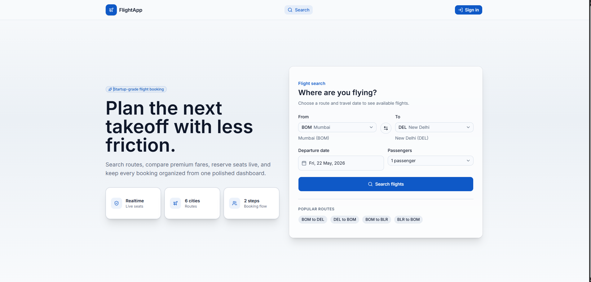
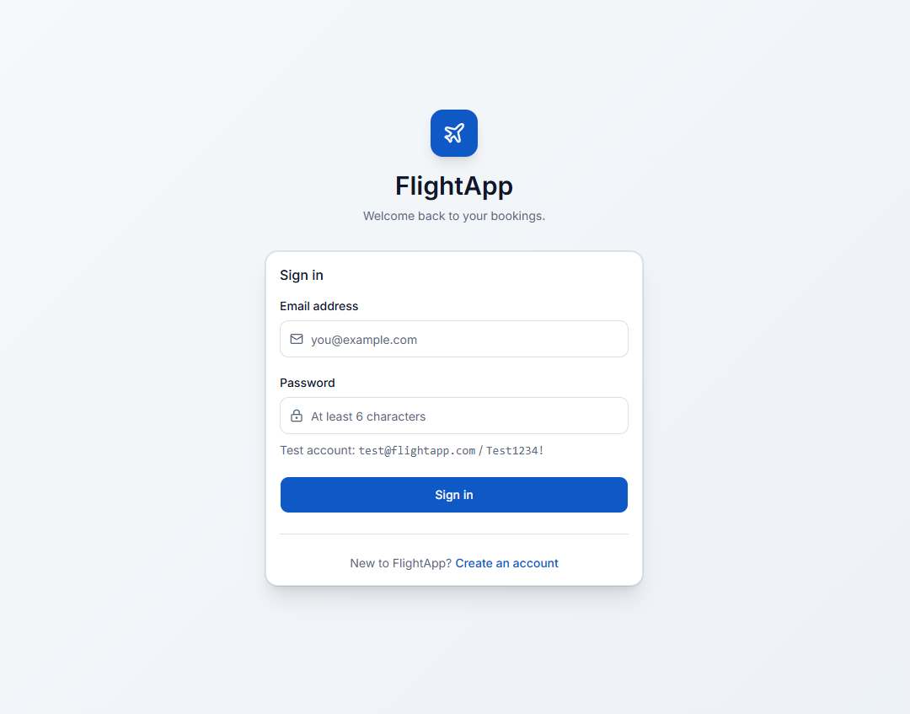
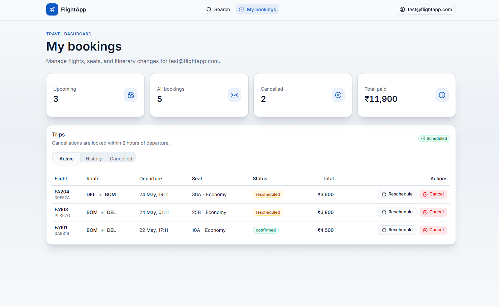
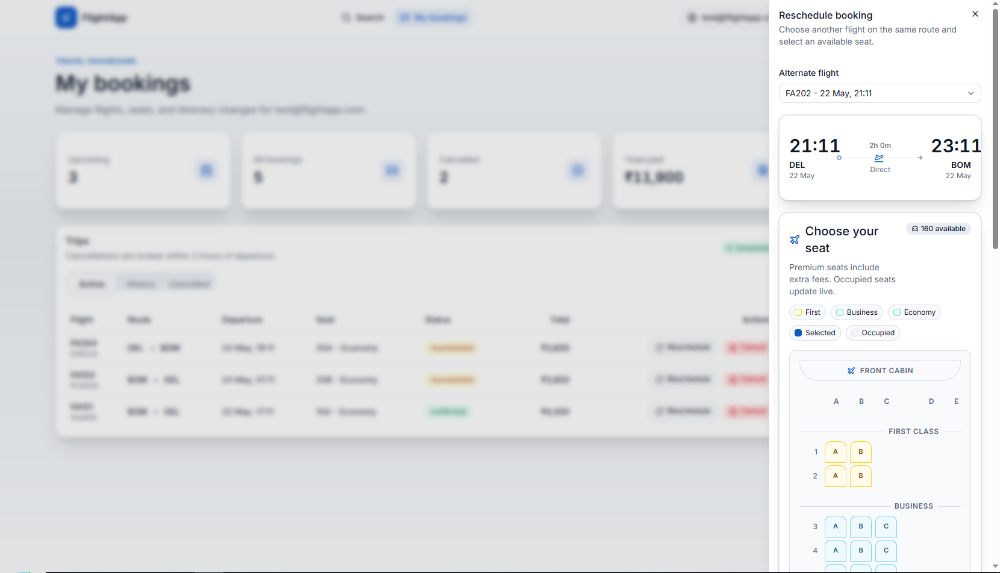
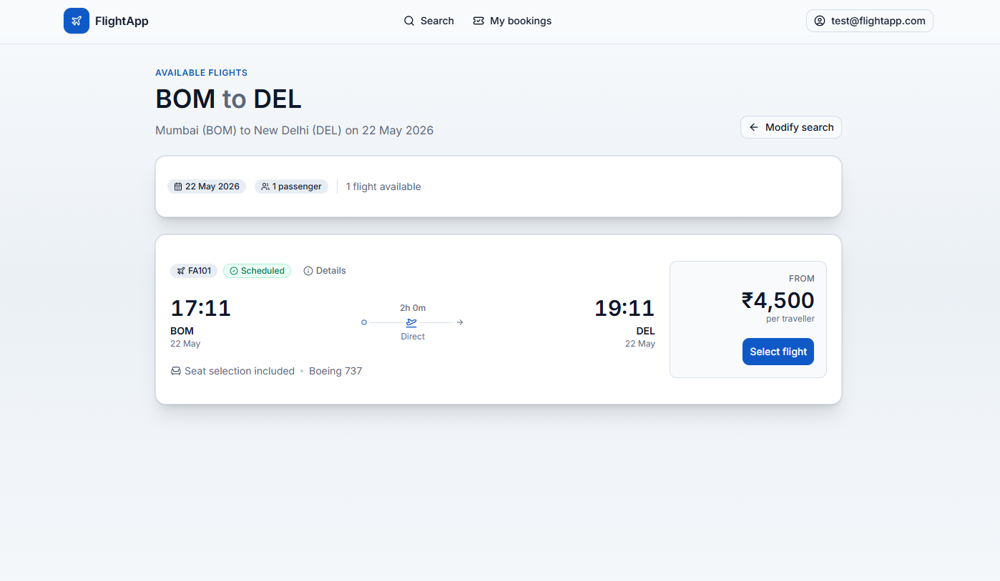
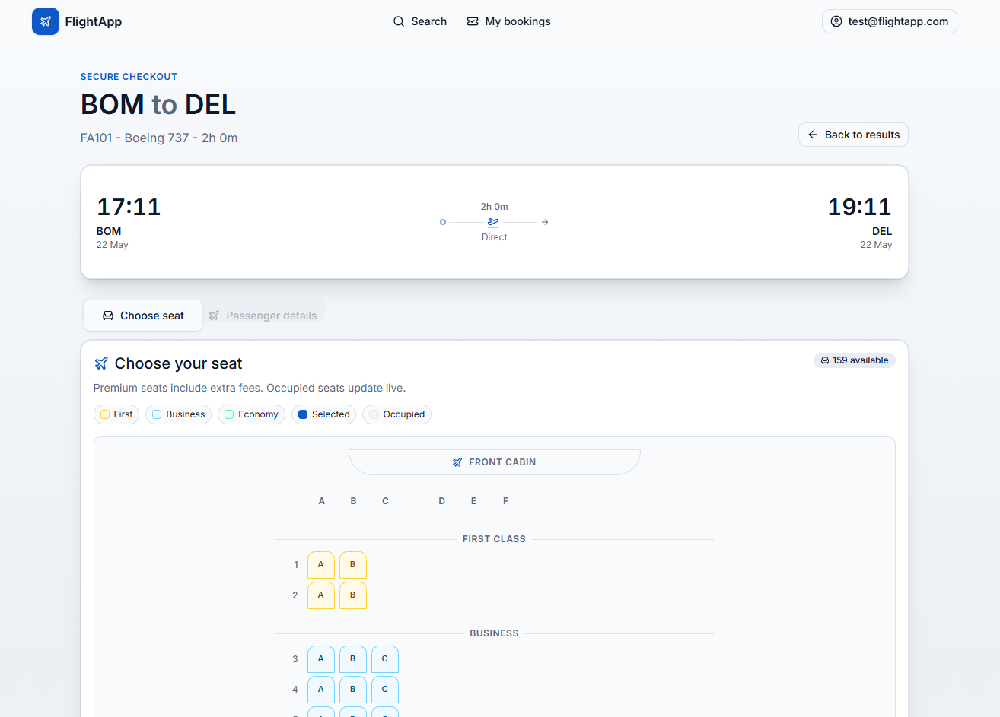
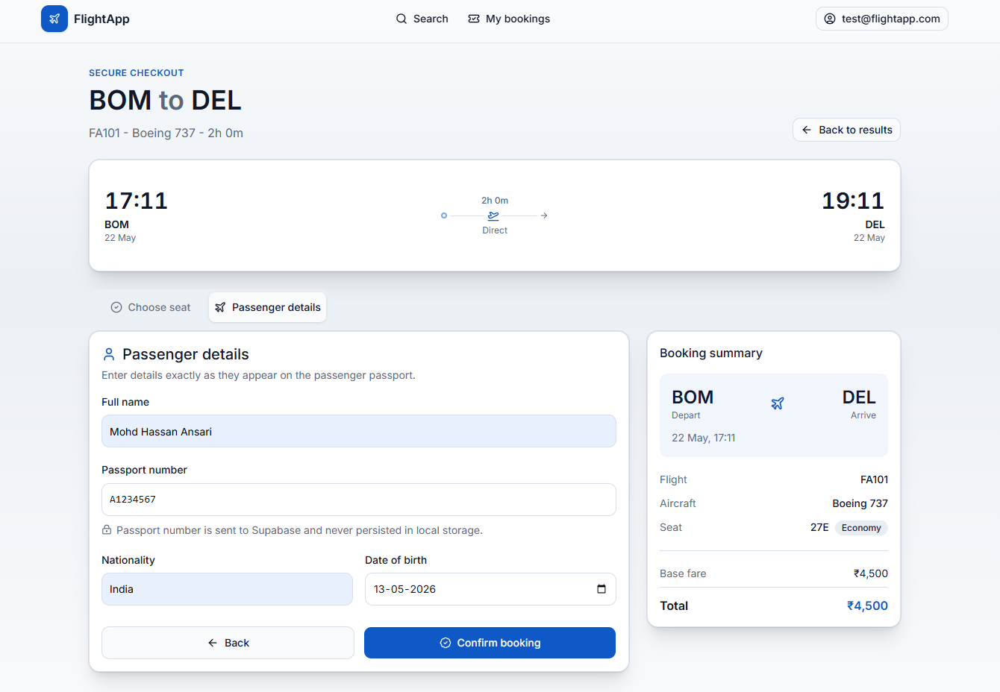
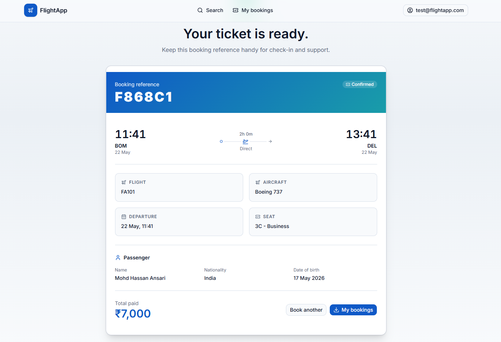

# ✈️ FlightApp — Flight Management PWA

A production-grade flight booking web application built with Next.js 14, Supabase, and Zustand. Passengers can search flights, select seats interactively, book with real-time availability, reschedule, and cancel — all with proper atomic DB operations and row-level security.

**[🚀 Live Demo](https://flightapp-cyan.vercel.app/)** · **[📹 Loom Walkthrough](https://www.loom.com/share/7ff9c79ce9864e398b538c365a3b0d60)**

---

## 📸 Screenshots










---

## 🗂️ Table of Contents

- [Tech Stack](#tech-stack)
- [Database Schema](#database-schema)
- [Local Setup](#local-setup)
- [Supabase Setup](#supabase-setup)
- [Zustand Store Structure](#zustand-store-structure)
- [Key Technical Decisions](#key-technical-decisions)
- [Trade-offs & What I'd Do Differently](#trade-offs--what-id-do-differently)
- [Test Credentials](#test-credentials)
- [Deployment](#deployment)

---

## 🛠 Tech Stack

| Layer | Technology |
|---|---|
| Framework | Next.js 16 (App Router) |
| Database | Supabase (PostgreSQL) |
| Auth | Supabase Auth |
| Realtime | Supabase Realtime |
| State Management | Zustand with persist middleware |
| Styling | Tailwind CSS |
| Language | TypeScript (strict, no `any`) |
| Deployment | Vercel |

---

## 🗄️ Database Schema

```
┌─────────────────────────────────────────────────────────────────────┐
│                        DATABASE SCHEMA                              │
├──────────────┐    ┌──────────────┐    ┌──────────────────────────── │
│   flights    │    │    seats     │    │        bookings             │
├──────────────┤    ├──────────────┤    ├─────────────────────────────┤
│ id (PK)      │───<│ flight_id(FK)│    │ id (PK)                     │
│ flight_no    │    │ id (PK)      │───<│ seat_id (FK)                │
│ origin       │    │ seat_number  │    │ flight_id (FK)──────────────┘
│ destination  │    │ class        │    │ user_id (FK → auth.users)
│ departs_at   │    │ is_available │    │ status
│ arrives_at   │    │ extra_fee    │    │ total_price
│ aircraft_type│    └──────────────┘    │ pnr_code
│ status       │                        │ booked_at
│ base_price   │          ┌─────────────┘
└──────────────┘          │
                          │    ┌─────────────────────┐
                          │    │     passengers      │
                          │    ├─────────────────────┤
                          └───<│ booking_id (FK)     │
                               │ full_name           │
                               │ passport_no         │
                               │ nationality         │
                               │ dob                 │
                               └─────────────────────┘

                          ┌─────────────────────────────┐
                          │         reschedules         │
                          ├─────────────────────────────┤
                          │ booking_id (FK)             │
                          │ old_flight_id (FK)          │
                          │ new_flight_id (FK)          │
                          │ fee_charged                 │
                          │ requested_at                │
                          └─────────────────────────────┘
```

### RLS Policies

Every table has Row Level Security enabled. The policies ensure:

- `flights` and `seats` — public read (anyone can search flights and view the seat map)
- `bookings` — users can only read/insert/update **their own** bookings (`auth.uid() = user_id`)
- `passengers` — scoped through booking ownership
- `reschedules` — scoped through booking ownership

### Atomic RPC Functions

| Function | Purpose |
|---|---|
| `reserve_seat(p_seat_id, p_flight_id, p_user_id, p_total_price)` | Locks the seat row with `SELECT FOR UPDATE`, marks it unavailable, and creates the booking atomically — prevents double-booking race conditions |
| `cancel_booking(p_booking_id)` | Cancels booking and frees the seat in a single transaction. Enforces the 2-hour pre-departure rule |
| `reschedule_booking(p_booking_id, p_new_flight_id, p_new_seat_id)` | Frees old seat, locks new seat, updates booking, inserts reschedule record, charges fee if new flight is pricier |

### DB-level Cancellation Trigger

A `BEFORE UPDATE` trigger on `bookings` fires whenever `status` changes to `'cancelled'`. It checks if `departs_at - now() < 2 hours` and raises an exception if true — enforced at the database level, not just in application code.

---

## 🚀 Local Setup

### Prerequisites

- Node.js 18+
- npm or yarn
- A Supabase project ([create one free](https://supabase.com))

### 1. Clone the repository

```bash
git clone https://github.com/mohd-hassan17/Flight-Management.git
cd flight-app
```

### 2. Install dependencies

```bash
npm install
```

### 3. Configure environment variables

```bash
cp .env.example .env.local
```

Open `.env.local` and fill in your Supabase credentials:

```env
NEXT_PUBLIC_SUPABASE_URL=your_supabase_project_url
NEXT_PUBLIC_SUPABASE_ANON_KEY=your_supabase_anon_key
```

Find these in: **Supabase Dashboard → Project Settings → API**

### 4. Run migrations

Go to **Supabase Dashboard → SQL Editor** and run each file in order:

```
supabase/migrations/001_create_tables.sql
supabase/migrations/002_rls_policies.sql
supabase/migrations/003_rpc_functions.sql
supabase/migrations/004_cancellation_trigger.sql
supabase/migrations/005_seed.sql
```

### 5. Enable Realtime

Go to **Supabase Dashboard → Database → Replication** and enable the `seats` table. This powers the live seat map updates.

### 6. Disable email confirmation (for local dev)

Go to **Supabase Dashboard → Authentication → Providers → Email** and turn off **"Confirm email"**.

### 7. Start the dev server

```bash
npm run dev
```

Open [http://localhost:3000](http://localhost:3000)

---

## ⚙️ Supabase Setup

### Project configuration checklist

- [x] RLS enabled on all 5 tables
- [x] `reserve_seat` RPC with `SELECT FOR UPDATE` for race condition safety
- [x] `cancel_booking` RPC — atomic cancel + seat release
- [x] `reschedule_booking` RPC — atomic old seat free + new seat lock
- [x] `trg_enforce_cancellation_window` trigger on `bookings` table
- [x] Realtime enabled on `seats` table
- [x] 8 flights seeded across 4 routes (BOM↔DEL, BOM↔BLR)
- [x] 148 seats per flight (2 first class rows, 4 business rows, 24 economy rows)

### Verify setup

Run in SQL Editor:

```sql
SELECT count(*) FROM public.flights;     -- 8
SELECT count(*) FROM public.seats;       -- 1184
SELECT count(*) FROM public.bookings;    -- 1 (test booking)
```

---

## 🧠 Zustand Store Structure

The app uses two Zustand stores, both with `persist` middleware.

### `useFlightStore`

Controls the entire booking journey from search to confirmation.

```
useFlightStore
├── searchQuery          → { origin, destination, date, passengers }
├── selectedFlight       → Full Flight object
├── selectedSeat         → Full Seat object (set OPTIMISTICALLY before RPC confirms)
├── currentStep          → 'search' | 'results' | 'seats' | 'passengers' | 'confirmation'
├── passengerData        → { full_name, passport_no, nationality, dob }
├── confirmedBookingId   → UUID after booking succeeds
├── confirmedPnr         → PNR code after booking succeeds
└── reset()              → Called on cancellation or logout
```

**`partialize` config** — only these fields are saved to `localStorage`:

```ts
partialize: (state) => ({
  searchQuery: state.searchQuery,
  selectedFlight: state.selectedFlight,
  selectedSeat: state.selectedSeat,
  currentStep: state.currentStep,
  confirmedBookingId: state.confirmedBookingId,
  confirmedPnr: state.confirmedPnr,
  // passengerData intentionally excluded — contains passport_no
})
```

`passport_no` never touches `localStorage`. This is enforced via `partialize`, not just convention.

### `useUserStore`

Manages auth session and booking cache.

```
useUserStore
├── session         → Supabase Session object
├── user            → Supabase User object
├── cachedBookings  → BookingWithDetails[] (for My Bookings stale-while-revalidate)
├── bookingsLoading → boolean
└── reset()         → Called on logout — wipes session and cache
```

**`partialize` config** — only session token is persisted:

```ts
partialize: (state) => ({
  session: state.session,
  user: state.user,
  // cachedBookings intentionally excluded — always re-fetched fresh
})
```

### Optimistic seat selection

When a user clicks a seat on the map, `setSelectedSeat(seat)` is called **immediately** — before the Supabase `reserve_seat` RPC responds. If the RPC fails (seat taken by another user), `setSelectedSeat(null)` is called to roll back the UI. This makes the seat map feel instant.

---

## 🔑 Test Credentials

| Field | Value |
|---|---|
| Email | `test@flightapp.com` |
| Password | `Test1234!` |

The test account has one pre-existing booking on flight `FA101` (BOM → DEL), seat `10A`.

---

## ⚖️ Key Technical Decisions

**Why `SELECT FOR UPDATE` in the RPC instead of a check-then-insert?**

A plain availability check followed by an insert creates a TOCTOU (time-of-check to time-of-use) race condition. Two users could both read `is_available = true`, both pass the check, and both insert a booking for the same seat. `SELECT FOR UPDATE` acquires a row-level lock — the second transaction blocks until the first commits, then reads the updated `is_available = false` and raises an exception.

**Why is the 2-hour cancellation rule in a DB trigger AND the RPC?**

The RPC check can be bypassed if someone calls the Supabase client directly (e.g. via the REST API with an anon key). The `BEFORE UPDATE` trigger fires unconditionally for any update to `bookings.status` — it's the last line of defence.

**Why `security definer` on RPCs?**

The RPC functions need to update `seats` (which has no direct update policy for clients) atomically with booking creation. `SECURITY DEFINER` lets them run with DB owner permissions while still doing their own `auth.uid()` ownership checks before any mutation.

---

## 🔄 Trade-offs & What I'd Do Differently

**Payment integration** — The app stores `total_price` but doesn't process real payments. I'd integrate Stripe with a webhook that confirms the booking only after payment succeeds, using an idempotency key tied to the PNR.

**Multi-passenger bookings** — The current flow books one passenger per booking. The schema supports multiple passengers per booking (`passengers` is a one-to-many), so extending the UI to collect N passenger forms (where N = search passenger count) is straightforward.

**Seat map performance** — The seat map renders all 148 seats on every flight. For larger aircraft (A380 with 500+ seats), I'd virtualise the list with `react-virtual` to avoid DOM bloat.

**Test coverage** — Given time constraints, I prioritised feature completeness over tests. I'd add Vitest unit tests for the Zustand stores and Playwright E2E tests for the booking flow, especially the race condition scenario.

**Error boundaries** — Currently errors surface as inline messages. I'd add React error boundaries around the seat map and booking form so a Realtime disconnect doesn't crash the whole page.

---

## 🎥 Loom Demo Walkthrough

> **[Watch the full demo →](https://www.loom.com/share/7ff9c79ce9864e398b538c365a3b0d60)**

The video covers:
1. DB schema overview in Supabase
2. Full booking flow — search → seat map → passenger form → confirmation
3. My Bookings — reschedule and cancel flows
4. 2-hour cancellation block in action
5. Zustand `partialize` proof — passport_no absent from localStorage
6. RLS proof — second user cannot see first user's bookings

---

## 🌐 Deployment

The app is deployed on **Vercel**.

**Live URL:** `https://flightapp-cyan.vercel.app/`

### Deploy your own

1. Push your repo to GitHub
2. Go to [vercel.com](https://vercel.com) → **New Project** → import your repo
3. Add environment variables in Vercel dashboard:
   - `NEXT_PUBLIC_SUPABASE_URL`
   - `NEXT_PUBLIC_SUPABASE_ANON_KEY`
4. Click **Deploy**

Vercel auto-deploys on every push to `main`.

---

## 📁 Project Structure

```
flight-app/
├── app/
│   ├── login/page.tsx              # Auth page
│   ├── search/page.tsx             # Flight search (homepage)
│   ├── flights/page.tsx            # Search results
│   ├── booking/[flightId]/page.tsx # Seat map + passenger form
│   ├── confirmation/[bookingId]/   # Booking confirmation + PNR
│   └── my-bookings/                # Manage bookings
│       ├── page.tsx
│       ├── MyBookingsClient.tsx
│       └── actions.ts              # Server actions for cancel/reschedule
├── components/
│   ├── flights/FlightCard.tsx
│   ├── seats/SeatMap.tsx           # Interactive seat grid with Realtime
│   ├── booking/BookingClient.tsx   # Multi-step booking wizard
│   ├── booking/PassengerForm.tsx
│   └── bookings/
│       ├── BookingsList.tsx
│       ├── RescheduleModal.tsx
│       └── ConfirmDialog.tsx
├── lib/
│   ├── supabase/client.ts          # Browser client
│   ├── supabase/server.ts          # Server client (SSR-safe)
│   ├── flights.ts                  # Server-side data helpers
│   └── utils.ts                    # Formatters, helpers
├── store/
│   ├── useFlightStore.ts           # Booking flow state + persist
│   └── useUserStore.ts             # Auth session + cache
├── types/
│   └── database.ts                 # All TypeScript types
├── middleware.ts                   # Auth session refresh + route protection
└── supabase/migrations/
    ├── 001_create_tables.sql
    ├── 002_rls_policies.sql
    ├── 003_rpc_functions.sql
    ├── 004_cancellation_trigger.sql
    └── 005_seed.sql
```

---

<p align="center">Built with ❤️ for the internship assignment · Next.js + Supabase + Zustand</p>